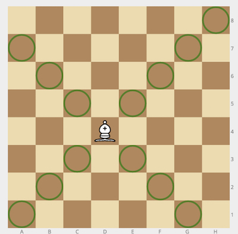
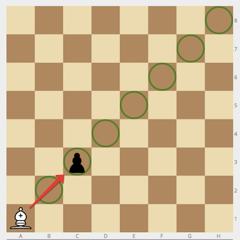
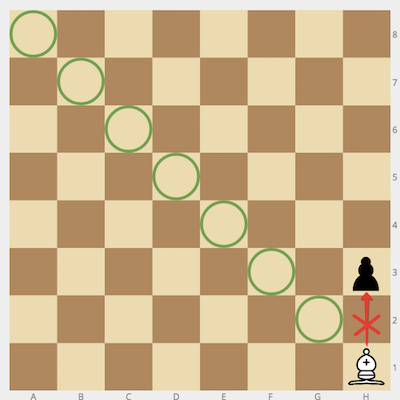

`Medium`	`Codewriting` 	`300`

Given the positions of a white bishop and a black pawn on the standard chess board, determine whether the bishop can capture the pawn in one move.

The bishop has no restrictions in distance for each move, but is limited to diagonal movement. Check out the example below to see how it can move:



## Example

- For `bishop = "a1"` and `pawn = "c3"`, the output should be
`bishopAndPawn(bishop, pawn) = true`.

    

- For `bishop = "h1"` and `pawn = "h3"`, the output should be
`bishopAndPawn(bishop, pawn) = false`.

    

## Input/Output

- [execution time limit] 4 seconds (go)

- [input] string bishop

    Coordinates of the white bishop in the chess notation.

    Guaranteed constraints: \
    `bishop.length = 2`, \
    `'a' ≤ bishop[0] ≤ 'h'`, \
    `1 ≤ bishop[1] ≤ 8`.

- [input] string pawn

    Coordinates of the black pawn in the same notation.

    Guaranteed constraints: \
    `pawn.length = 2`, \
    `'a' ≤ pawn[0] ≤ 'h'`, \
    `1 ≤ pawn[1] ≤ 8`.

- [output] boolean

    `true` if the bishop can capture the pawn, `false` otherwise.

## [Go] Syntax Tips

``` go
// Prints help message to the console
// Returns a string
func helloWorld(name string) string {
    fmt.Printf("This prints to the console when you Run Tests");
    return "Hello, " + name;
}
```
