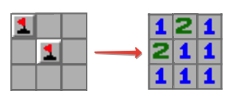

`Medium`	`Codewriting` 	`300`

In the popular Minesweeper game you have a board with some mines and those cells that don't contain a mine have a number in it that indicates the total number of mines in the neighboring cells. Starting off with some arrangement of mines we want to create a Minesweeper game setup.

## Example

- For

```bash
matrix = [[true, false, false],
          [false, true, false],
          [false, false, false]]
```

the output should be

```bash
minesweeper(matrix) = [[1, 2, 1],
                       [2, 1, 1],
                       [1, 1, 1]]
```

Check out the image below for better understanding:



## Input/Output

- [execution time limit] 4 seconds (go)

- [input] array.array.boolean matrix

    A non-empty rectangular matrix consisting of boolean values - true if the corresponding cell contains a mine, false otherwise.

    Guaranteed constraints: \
    `2 ≤ matrix.length ≤ 100`, \
    `2 ≤ matrix[0].length ≤ 100`.

- [output] array.array.integer

    Rectangular matrix of the same size as matrix each cell of which contains an integer equal to the number of mines in the neighboring cells. Two cells are called neighboring if they share at least one corner.

## [Go] Syntax Tips

``` go
// Prints help message to the console
// Returns a string
func helloWorld(name string) string {
    fmt.Printf("This prints to the console when you Run Tests");
    return "Hello, " + name;
}
```
