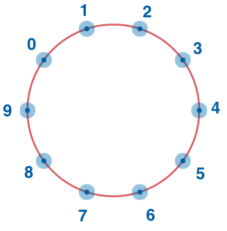

`Easy`	`Codewriting` 	`300`

Consider integer numbers from 0 to n - 1 written down along the circle in such a way that the distance between any two neighboring numbers is equal (note that 0 and n - 1 are neighboring, too).

Given n and firstNumber, find the number which is written in the radially opposite position to firstNumber.

## Example

- For `n = 10` and `firstNumber = 2`, the output should be
`circleOfNumbers(n, firstNumber) = 7`.

    

## Input/Output

- [execution time limit] 4 seconds (go)

- [input] integer n

    A positive even integer.

    Guaranteed constraints: \
    `4 ≤ n ≤ 20`. \

- [input] integer firstNumber

    Guaranteed constraints: \
    `0 ≤ firstNumber ≤ n - 1`.

- [output] integer

## [Go] Syntax Tips

``` go
// Prints help message to the console
// Returns a string
func helloWorld(name string) string {
    fmt.Printf("This prints to the console when you Run Tests");
    return "Hello, " + name;
}
```
