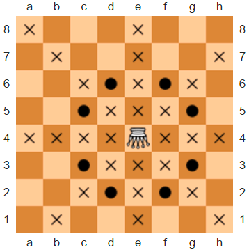
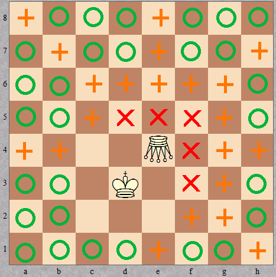
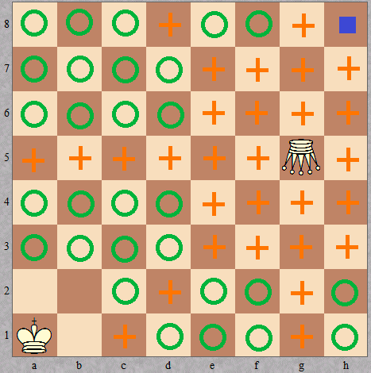
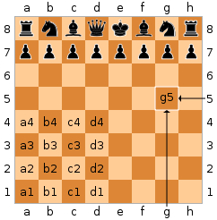

`Medium`	`Codewriting` 	`300`

## Description

---

An amazon (also known as a _queen_ + _knight compound_) is an imaginary chess piece that can move like a queen or a knight (or, equivalently, like a rook, bishop, or knight). The diagram below shows all squares which the amazon can attack from <code>e4</code> (circles represent knight-like moves while crosses correspond to queen-like moves).



Recently, you've come across a diagram with only three pieces left on the board: a white _amazon_, the white king, and the black king. It's black's move. You don't have time to determine whether the game is over or not, but you'd like to figure it out in your head. Unfortunately, the diagram is smudged and you can't see the position of the black king, so you'll need to consider all possible positions.

Given the positions of the white pieces on a standard chessboard (using algebraic notation), your task is to determine the number of possible black king's positions such that:

- it's checkmate (i.e. black's king is under the amazon's attack and it cannot make a valid move);
- it's check (i.e. black's king is under the amazon's attack but it can reach a safe square in one move);
- it's stalemate (i.e. black's king is on a safe square but it cannot make a valid move);
- black's king is on a safe square and it can make a valid move.

Note that two kings cannot be placed on two adjacent squares (including two diagonally adjacent ones).

**Example**

- For <code>king = "d3"</code> and <code>amazon = "e4"</code>, the output should be
  <code>amazonCheckmate(king, amazon) = [5, 21, 0, 29]</code>.

  

  Red crosses correspond to the checkmate positions, orange pluses refer to check positions, and green circles denote safe squares.

- For <code>king = "a1"</code> and <code>amazon = "g5"</code>, the output should be
  <code>amazonCheckmate(king, amazon) = [0, 29, 1, 29]</code>.

  

  The stalemate position is marked by a blue square.

**Input/Output**

- **[execution time limit] 4 seconds (js)**
- **[input] string king**

  The position of the white king, in chess notation.<br>

  _Guaranteed constraints:_<br>
  <code>king.length = 2</code>,<br>
  <code>'a' ≤ king[0] ≤ 'h'</code>,<br>
  <code>1 ≤ king[1] ≤ 8</code>.

  Note (Chess notation): Each square of the chessboard is identified by a unique coordinate pair—a letter and a number. The vertical columns of squares from white's left to the right are labeled 'a' through 'h'. The horizontal rows of squares are numbered 1 to 8 starting from white's side of the board. Thus each square has a unique identification as a string consisting of two characters: the first is the column label, and the second in the row number.

  

- **[input] string amazon**
  The position of the white amazon, in the same notation.<br>

  _Guaranteed constraints:_<br>
  <code>amazon.length = 2</code>,<br>
  <code>'a' ≤ amazon[0] ≤ 'h'</code>,<br>
  <code>1 ≤ amazon[1] ≤ 8</code>,<br>
  <code>amazon ≠ king</code>.

* **[output] array.integer**
  - An array of four integers, each equal to the number of black's king positions corresponding to a specific situation. More specifically, the array should be of the form <code>[checkmate positions, check positions, stalemate positions, safe positions]</code>.

## [Java] Syntax Tips

``` java
// Prints help message to the console
// Returns a string
// 
// Globals declared here will cause a compilation error,
// declare variables inside the function instead!
String helloWorld(String name) {
    System.out.println("This prints to the console when you Run Tests");
    return "Hello, " + name;
}
```
