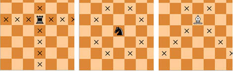
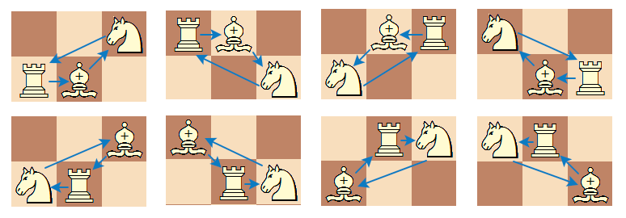

`Medium`	`Codewriting` 	`300`

## Description

---

Consider a bishop, a knight and a rook on an <code>n × m</code> chessboard. They are said to form a _triangle_ if each piece attacks exactly one other piece and is attacked by exactly one piece. Calculate the number of ways to choose positions of the pieces to form a _triangle_.

Note that the bishop attacks pieces sharing the common diagonal with it; the rook attacks in horizontal and vertical directions; and, finally, the knight attacks squares which are two squares horizontally and one square vertically, or two squares vertically and one square horizontally away from its position.



**Example**

For <code>n = 2</code> and <code>m = 3</code>, the output should be
<code>chessTriangle(n, m) = 8</code>.



**Input/Output**

- **[execution time limit] 4 seconds (js)**
- **[input] integer n**

  _Guaranteed constraints:_<br>
  <code>1 ≤ n ≤ 40</code>.

- **[input] integer m**

  _Guaranteed constraints:_<br>
  <code>1 ≤ m ≤ 40</code>,<br>
  <code>3 ≤ n · m</code>.

* **[output] integer**

## [Java] Syntax Tips

``` java
// Prints help message to the console
// Returns a string
// 
// Globals declared here will cause a compilation error,
// declare variables inside the function instead!
String helloWorld(String name) {
    System.out.println("This prints to the console when you Run Tests");
    return "Hello, " + name;
}
```
