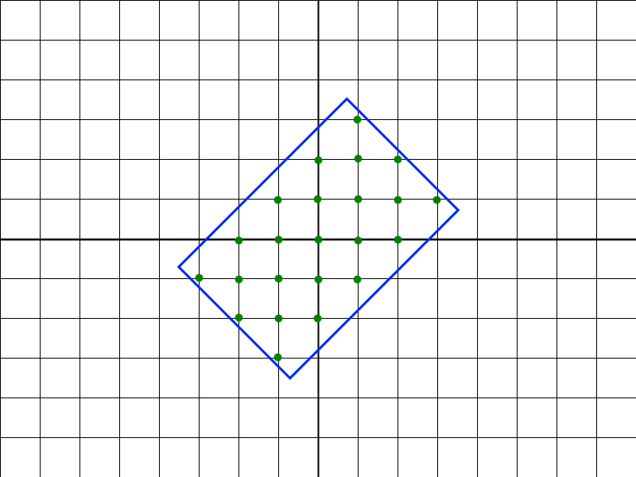

`Medium`	`Codewriting` 	`300`


## Description

---

A rectangle with sides equal to even integers <code>a</code> and <code>b</code> is drawn on the Cartesian plane. Its center (the intersection point of its diagonals) coincides with the point <code>(0, 0)</code>, but the sides of the rectangle are not parallel to the axes; instead, they are forming <code>45</code> degree angles with the axes.

How many points with integer coordinates are located inside the given rectangle (including on its sides)?

**Example**

For <code>a = 6</code> and <code>b = 4</code>, the output should be
<code>rectangleRotation(a, b) = 23</code>.

The following picture illustrates the example, and the <code>23</code> points are marked green.



**Input/Output**

- **[execution time limit] 4 seconds (js)**

- **[input] integer a**

  A positive even integer.<br>

  _Guaranteed constraints:_<br>
  <code>2 ≤ a ≤ 50</code>.

- **[input] integer b**

  A positive even integer.<br>

  _Guaranteed constraints:_<br>
  <code>2 ≤ b ≤ 50</code>.

- **[output] integer**
  - The number of inner points with integer coordinates.


## [Java] Syntax Tips

``` java
// Prints help message to the console
// Returns a string
// 
// Globals declared here will cause a compilation error,
// declare variables inside the function instead!
String helloWorld(String name) {
    System.out.println("This prints to the console when you Run Tests");
    return "Hello, " + name;
}
```
