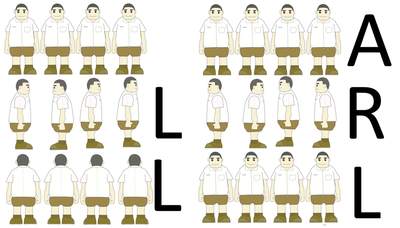

`Medium`	`Codewriting` 	`300`

## Description

---

To prepare his students for an upcoming game, the sports coach decides to try some new training drills. To begin with, he lines them up and starts with the following warm-up exercise: when the coach says <code>'L'</code>, he instructs the students to turn to the left. Alternatively, when he says <code>'R'</code>, they should turn to the right. Finally, when the coach says <code>'A'</code>, the students should turn around.

Unfortunately some students (not all of them, but at least one) can't tell left from right, meaning they always turn right when they hear <code>'L'</code> and left when they hear <code>'R'</code>. The coach wants to know how many times the students end up facing the same direction.

Given the list of commands the coach has given, count the number of such commands after which the students will be facing the same direction.

**Example**

For <code>commands = "LLARL"</code>, the output should be
<code>lineUp(commands) = 3</code>.

Let's say that there are <code>4</code> students, and the second one can't tell left from right. In this case, only after the second, third and fifth commands will the students face the same direction.



**Input/Output**

- **[execution time limit] 4 seconds (js)**

- **[input] string commands**

  String consisting of characters <code>'L'</code>, <code>'R'</code> and <code>'A'</code> only.

  _Guaranteed constraints:_<br>
  <code type='math/tex'>0 \leq commands.length \leq 35</code>.

- **[output] integer**

## [Java] Syntax Tips

``` java
// Prints help message to the console
// Returns a string
// 
// Globals declared here will cause a compilation error,
// declare variables inside the function instead!
String helloWorld(String name) {
    System.out.println("This prints to the console when you Run Tests");
    return "Hello, " + name;
}
```
