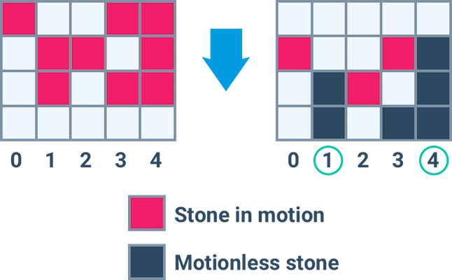

`Medium`	`Codewriting` 	`300`

## Description

---

You are given a vertical box divided into equal columns. Someone dropped several stones from its top through the columns. Stones are falling straight down at a constant speed (equal for all stones) while possible (i.e. while they haven't reached the ground or they are not blocked by another motionless stone). Given the state of the box at some moment in time, find out which columns become motionless first.

**Example**

For

<code type='preformat'>
rows = ["#..##",
        ".##.#",
        ".#.##",
        "....."]
</code>

the output should be

<code type='preformat'>
gravitation(rows) = [1, 4].
</code>



**Input/Output**

- **[execution time limit] 4 seconds (js)**

- **[input] array.string rows**

  A non-empty array of strings of equal length consisting only of <code>#</code>-s and <code>.</code>-s describing the box at a specific moment in time. Sharps represent stones, and dots represent empty cells. <code>row[0]</code> corresponds to the upper row. Last element of <code>rows</code> corresponds to the ground level.

  _Guaranteed constraints:_<br>
  <code>2 ≤ rows.length ≤ 100</code>,<br>
  <code>2 ≤ rows[i].length ≤ 100</code>.

* **[output] array.integer**
  - A sorted array containing numbers of all columns (leftmost column's number is <code>0</code>) in which movements will stop at the same second and earlier than in any other column. Assume that if there are no stones in a column then movement stops immediately, i.e. after <code>0</code> seconds.

## [Java] Syntax Tips

``` java
// Prints help message to the console
// Returns a string
// 
// Globals declared here will cause a compilation error,
// declare variables inside the function instead!
String helloWorld(String name) {
    System.out.println("This prints to the console when you Run Tests");
    return "Hello, " + name;
}
```
