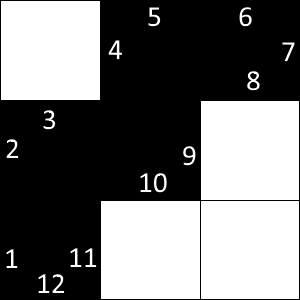
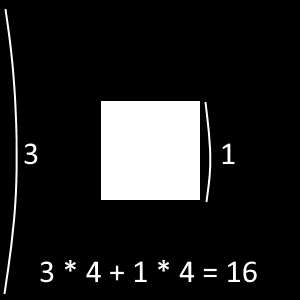

`Medium`	`Codewriting` 	`300`

## Description

---

You have a rectangular white board with some black cells. The black cells create a connected black figure, i.e. it is possible to get from any black cell to any other one through connected adjacent (sharing a common side) black cells.

Find the perimeter of the black figure assuming that a single cell has unit length.

It's guaranteed that there is at least one black cell on the table.

**Example**

- For

  <code type='preformat'>
  matrix = [[false, true,  true ],
            [true,  true,  false],
            [true,  false, false]]
  </code>

  the output should be

  <code type='preformat'>
  polygonPerimeter(matrix) = 12.
  </code>

  

- For

  <code type='preformat'>
  matrix = [[true, true,  true],
            [true, false, true],
            [true, true,  true]]
  </code>

  the output should be

  <code type='preformat'>
  polygonPerimeter(matrix) = 16.

  </code>

  

**Input/Output**

- **[execution time limit] 4 seconds (js)**

- **[input] array.array.boolean matrix**

  A matrix of booleans representing the rectangular board where <code>true</code> means a _black_ cell and <code>false</code> means a _white_ one.

  _Guaranteed constraints:_<br>
  <code>2 ≤ matrix.length ≤ 5</code>,<br>
  <code>2 ≤ matrix[0].length ≤ 5</code>.

* **[output] integer**

## [Java] Syntax Tips

``` java
// Prints help message to the console
// Returns a string
// 
// Globals declared here will cause a compilation error,
// declare variables inside the function instead!
String helloWorld(String name) {
    System.out.println("This prints to the console when you Run Tests");
    return "Hello, " + name;
}
```
