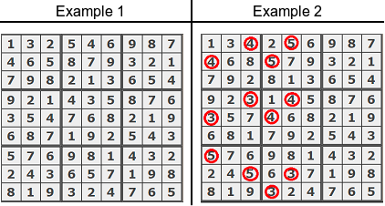

`Medium`	`Codewriting` 	`300`

## Description

---

_Sudoku_ is a number-placement puzzle. The objective is to fill a <code>9 × 9</code> grid with digits so that each column, each row, and each of the nine <code>3 × 3</code> sub-grids that compose the grid contains all of the digits from <code>1</code> to <code>9</code>.

This algorithm should check if the given grid of numbers represents a correct solution to Sudoku.

**Example**

- For

  <code type='preformat'>
  grid = [[1, 3, 2, 5, 4, 6, 9, 8, 7],
          [4, 6, 5, 8, 7, 9, 3, 2, 1],
          [7, 9, 8, 2, 1, 3, 6, 5, 4],
          [9, 2, 1, 4, 3, 5, 8, 7, 6],
          [3, 5, 4, 7, 6, 8, 2, 1, 9],
          [6, 8, 7, 1, 9, 2, 5, 4, 3],
          [5, 7, 6, 9, 8, 1, 4, 3, 2],
          [2, 4, 3, 6, 5, 7, 1, 9, 8],
          [8, 1, 9, 3, 2, 4, 7, 6, 5]]
  </code>

  the output should be <code>sudoku(grid) = true</code>;

- For

  <code type='preformat'>
  grid = [[1, 3, 2, 5, 4, 6, 9, 2, 7],
          [4, 6, 5, 8, 7, 9, 3, 8, 1],
          [7, 9, 8, 2, 1, 3, 6, 5, 4],
          [9, 2, 1, 4, 3, 5, 8, 7, 6],
          [3, 5, 4, 7, 6, 8, 2, 1, 9],
          [6, 8, 7, 1, 9, 2, 5, 4, 3],
          [5, 7, 6, 9, 8, 1, 4, 3, 2],
          [2, 4, 3, 6, 5, 7, 1, 9, 8],
          [8, 1, 9, 3, 2, 4, 7, 6, 5]]
  </code>

  the output should be <code>sudoku(grid) = false</code>.

The output should be <code>false</code>: each of the nine <code>3 × 3</code> sub-grids should contain all of the digits from <code>1</code> to <code>9</code>.<br>
These examples are represented on the image below.



**Input/Output**

- **[execution time limit] 4 seconds (js)**

- **[input] array.array.integer grid**

  A matrix representing <code>9 × 9</code> grid already filled with numbers from <code>1</code> to <code>9</code>.<br>

  _Guaranteed constraints:_<br>
  <code>grid.length = 9</code>,<br> <code>grid[i].length = 9</code>,<br> <code>1 ≤ grid[i][j] ≤ 9</code>.

* **[output] boolean**
  - <code>true</code> if the given grid represents a correct solution to Sudoku, <code>false</code> otherwise.

## [Java] Syntax Tips

``` java
// Prints help message to the console
// Returns a string
// 
// Globals declared here will cause a compilation error,
// declare variables inside the function instead!
String helloWorld(String name) {
    System.out.println("This prints to the console when you Run Tests");
    return "Hello, " + name;
}
```
